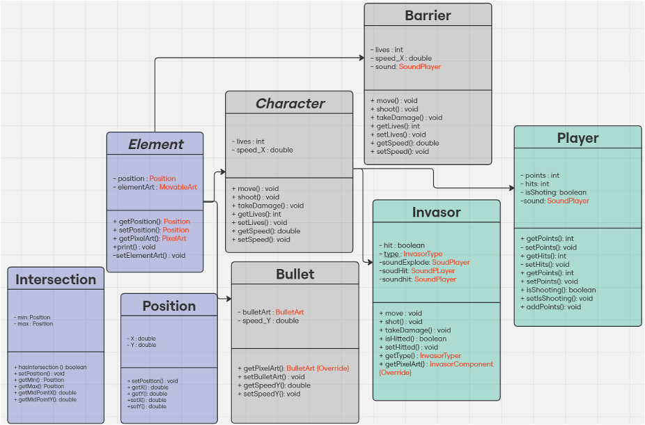
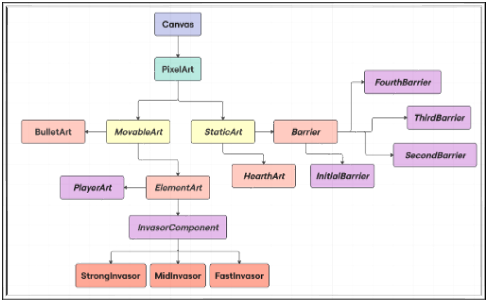

# 👾 Space Invaders em JavaFX

Este projeto é uma recriação do clássico jogo *Space Invaders*, desenvolvido como parte da disciplina **Programação Orientada a Objetos**. Utilizamos **Java** com **JavaFX** para criar a interface gráfica e controlar a lógica de jogo, aplicando princípios fundamentais da orientação a objetos.

---

## 📚 Conteúdos abordados

- Programação orientada a objetos: herança, polimorfismo, encapsulamento e composição
- Hierarquia de classes com modelagem extensível
- Detecção de colisões
- Controle de entidades (jogador, invasores, barreiras e projéteis)
- Manipulação de sons e sprites
- Interface gráfica com JavaFX
- Estruturação modular do código

---

## 🧩 Diagramas de Classe

Durante o desenvolvimento, foram construídos e aplicados **diagramas de classe** para guiar a arquitetura do sistema e facilitar a visualização da estrutura entre os componentes.

### Diagrama de classes das entitades do jogo

<p align="center">Fonte: imagem própria (2024)</p>

### Diagrama de herança das Pixel Art's

<p align="center">Fonte: imagem própria (2024)</p>

---

## 💻 Tecnologias utilizadas

- Java 17+
- JavaFX 20
- Scene Builder
- VS Code
- Git & GitHub

---

## 🗂️ Estrutura do Projeto

```bash
src/
└── com/
    └── spaceinvaders/
        ├── application     # Inicialização da aplicação
        ├── assets          # Recursos do jogo (sprites, sons)
        ├── components      # Entidades visuais do jogo
        ├── controller      # Lógica de controle do jogo
        ├── enums           # Tipos enumerados
        ├── model           # Lógica de dados e estrutura
        ├── utils           # Utilitários
        └── view            # Interface gráfica
```

---

## ▶️ Como executar o projeto

1. Clone o repositório:
```bash
git clone https://github.com/guiandradedev/space-invaders
```

2. Importe o projeto em sua IDE de preferência (IntelliJ ou VS Code com suporte a JavaFX).

3. Execute a classe `Main.java` em `application/Main.java`.

> ⚠️ Certifique-se de ter o JavaFX configurado corretamente no seu ambiente.

---

## 🎥 Demonstração em vídeo

Confira o vídeo de demonstração do projeto [clicando aqui]().

---

## 🤝 Participação

Projeto desenvolvido com meus colegas **[Guilherme Ximenes](https://github.com/ximeninh0)** e **[Luigi Zanon](https://github.com/LuigiZanon)**.

---

## 👨‍🏫 Agradecimentos

Agradeço ao professor **Ademar Takeo** pelas aulas e orientações ao longo da disciplina.

---

## 📦 Repositório no GitHub

O código-fonte completo está disponível neste repositório: [github.com/guiandradedev/space-invaders](https://github.com/guiandradedev/space-invaders)